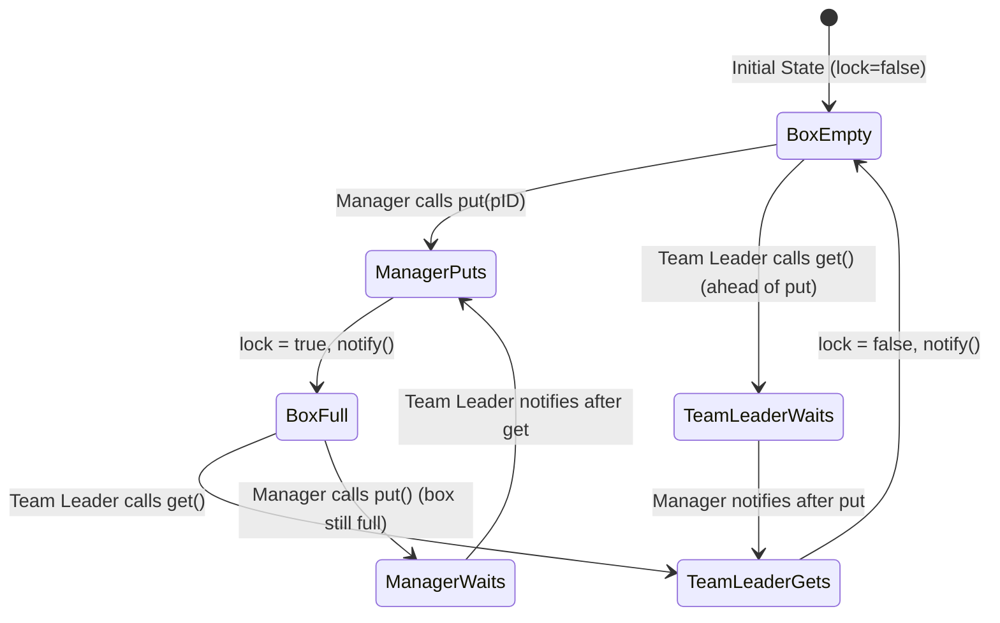
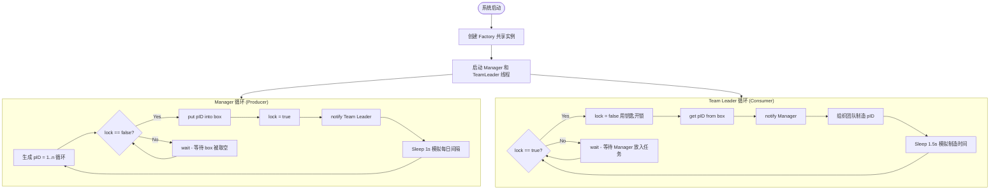

# 项目设计文档 - Factory Production Synchronization System

## 1. 系统架构

```mermaid
flowchart TD
    subgraph Main["Main Entry Point"]
        M[Main.java]
    end

    subgraph Shared["Shared Resource"]
        F[Factory<br/>Task Box with Lock]
    end

    subgraph Producer["Producer Thread"]
        MP[ManagerProcess<br/>puts pID into box]
    end

    subgraph Consumer["Consumer Thread"]
        TL[TeamLeaderProcess<br/>gets pID from box]
    end

    M -->|creates & starts| MP
    M -->|creates & starts| TL
    M -->|creates| F
    MP -->|put(pID)| F
    F -->|get() returns pID| TL
    MP -.->|notify()| TL
    TL -.->|notify()| MP
```

## 2. 核心同步机制



### 同步规则

| 角色 | 条件 | 行为 |
|------|------|------|
| Manager (Producer) | lock == false (opened) | 执行 put(pID), lock=true, notify() |
| Manager (Producer) | lock == true (locked) | wait() 等待 Team Leader 取走任务 |
| Team Leader (Consumer) | lock == true (locked) | lock=false (用钥匙开锁), get pID, notify() |
| Team Leader (Consumer) | lock == false (opened) | wait() 等待 Manager 放入任务 |

## 3. 核心业务流程



## 4. 类设计

### 4.1 Factory (模型层 - 共享资源)

```
Factory
├── Fields
│   ├── pID: int              — 生产类型 ID (1..n)
│   └── lock: boolean         — 锁状态 (false=opened, true=locked)
├── Methods
│   ├── synchronized void put(int pID)  — Manager 放入生产类型
│   └── synchronized int get()          — Team Leader 获取生产类型
└── Synchronization
    ├── put(): while(lock) wait()  →  set pID  →  lock=true  →  notify()
    └── get(): while(!lock) wait() →  lock=false →  read pID  →  notify()
```

### 4.2 ManagerProcess (生产者进程)

```
ManagerProcess implements Runnable
├── Fields
│   ├── factory: Factory          — 共享 Factory 实例
│   └── maxProductionTypes: int   — 生产类型最大值 n
├── Constructor
│   └── ManagerProcess(Factory, int)
└── Methods
    └── void run()  — 循环 put(1), put(2), ..., put(n), put(1), ...
```

### 4.3 TeamLeaderProcess (消费者进程)

```
TeamLeaderProcess implements Runnable
├── Fields
│   └── factory: Factory          — 共享 Factory 实例
├── Constructor
│   └── TeamLeaderProcess(Factory)
└── Methods
    └── void run()  — 循环 get() 并模拟制造过程
```

### 4.4 Main (入口)

```
Main
└── static void main(String[])
    ├── 创建 Factory 实例
    ├── 创建 Manager 线程 (Producer)
    ├── 创建 Team Leader 线程 (Consumer)
    ├── 注册 ShutdownHook (优雅关闭)
    └── 启动两个线程并 join 等待
```

## 5. 技术选型

| 技术 | 选择 | 理由 |
|------|------|------|
| 语言 | Java 17 | 原生支持 synchronized/wait/notify |
| 构建工具 | Maven | 标准 Java 项目构建 |
| 日志框架 | SLF4J + Logback | 行业标准，支持结构化日志 |
| 并发模型 | Java 内置 synchronized | 题目要求使用 wait/notify |

## 6. 项目结构

```
label-02361/
├── backend/
│   ├── pom.xml
│   └── src/main/java/com/factory/
│       ├── Main.java                    # 程序入口
│       ├── model/
│       │   └── Factory.java             # 核心同步类 (put/get)
│       └── process/
│           ├── ManagerProcess.java      # Manager 生产者线程
│           └── TeamLeaderProcess.java   # Team Leader 消费者线程
├── docs/
│   └── project_design.md               # 本设计文档
├── README.md
├── start.sh                            # Linux/macOS 启动脚本
├── start.bat                           # Windows 启动脚本
└── draft.md                            # 项目总结
```
